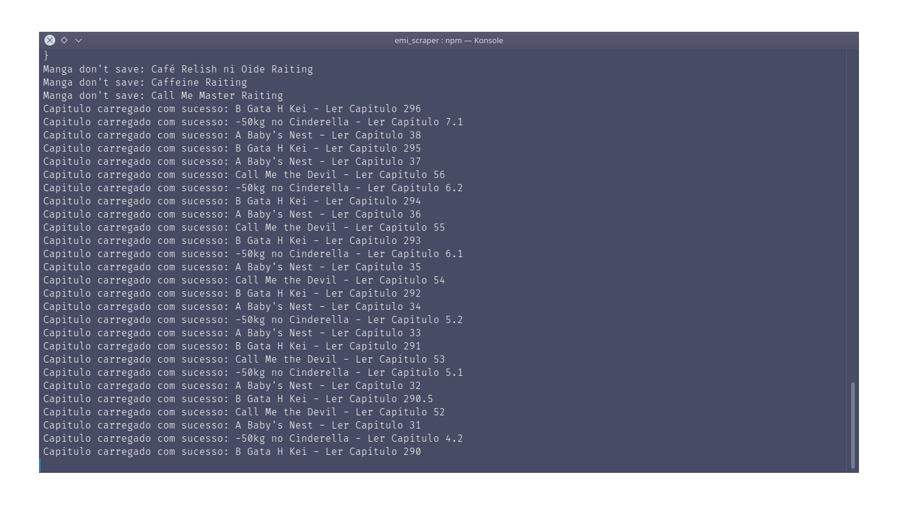

# Sobre o projeto

O projeto visa a extração do links estáticos refentes aos mangás disponibilizados no site [mangalivre](https://mangalivre.net/), para que seja possível a criação de um banco de dados local com os links de todos os mangás disponíveis no site. A motivação inicial para a criação do projeto foi um desafio pessoal de criar o programa mais eficiente possível para a extração de uma grande quantidade de dados do site, que possuí mais de 16 mil titulos. Isso se tornou mais desafiador a medida que os avanços aconteciam, pois o site possui muitas nuancias que dificultam a extração.

Imagem do site:


## Como executar o projeto

### Pré-requisitos

- **docker** & **docker-compose**
- **node** & **npm**

### Executando o projeto

1. Clone o repositório

```bash
git clone https://github.com/certainlyWrong/emi_scraper.git
```

2. Instale as dependências

```bash
npm i
```

3. Execute o container do MongoDB

```bash
docker-compose up -d
```

4. Execute o script de extração

```bash
npm run local
```

**OBS!!! O processo de extração pode demorar dias para ser concluído.**



## Tecnologias utilizadas

- **Typescript**: Linguagem de programação utilizada para o desenvolvimento do projeto.

- **Node.js**: Ambiente de execução do javascript utilizado para a execução do projeto.

- **Puppeteer**: Todo conteúdo relevante do site é carregado dinamicamente, o que dificulta a extração dos dados. O puppeteer é uma biblioteca que permite a automação de um navegador, o que permite a extração dos dados de forma mais eficiente.

- **MongoDB**: Banco de dados não relacional utilizado para armazenar os dados brutos extraídos do site.

- **Docker**: Ferramenta utilizada para executa o container do MongoDB.

- **Prisma**: ORM utilizado para a conexão com o sqlite, que é utilizado para armazenar os dados extraídos do site ao final do processo.

- **Sqlite**: Banco de dados relacional utilizado para armazenar os dados extraídos do site ao final do processo.
